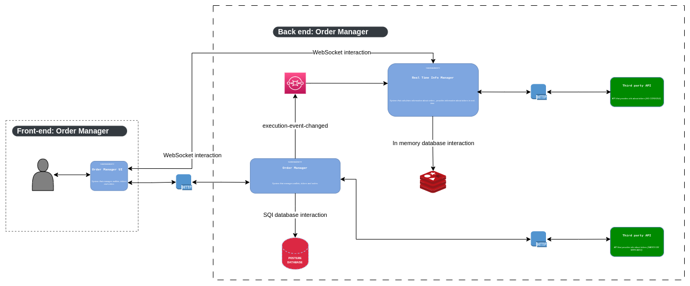

## Microservice: Managing investments( Back-end ).

## :pushpin: Application purpose

- This application is a part of an Undergraduate Thesis.
- The application is an investment manager, where the user can invest with security and monitor investments easily

## :warning: Warning

- It's not the intention of this Undergraduate Thesis create a commercial product but something didactic
  to put into practice what was learned in the Graduation.

## :wrench: Architecture fluxogram

## :ballot_box_with_check: Progress of the project

- [x] Initialize application
- [x] Implementation about Wallet ⚠  *in progress*

### :robot: Back-end:

[//]: # (![Badge]&#40;https://img.shields.io/badge/MySQL--%236DB33F?style=for-the-badge&logo=MySQL&color=4479A1&#41;)

[//]: # (![Badge]&#40;https://img.shields.io/badge/Apache_Kafka--%2347A248?style=for-the-badge&logo=ApacheKafka&color=231F20&#41;)

[//]: # (![Badge]&#40;https://img.shields.io/badge/RabbitMQ--%2347A248?style=for-the-badge&logo=RabbitMQ&color=FF6600&#41;)

[//]: # (![Badge]&#40;https://img.shields.io/badge/FlyWay--%2347A248?style=for-the-badge&logo=Flyway&color=CC0200&#41;)

