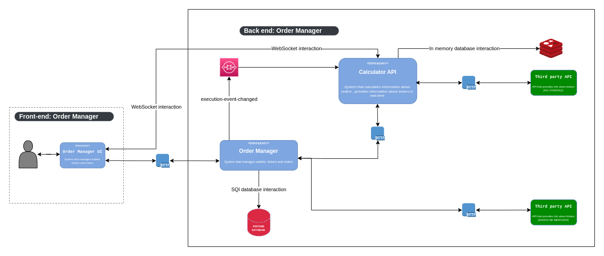

## Microservice: Managing investments( Back-end ).

The application is an investment manager, where the user can invest with security and monitor investments easily
This application is a part of an Undergraduate Thesis.

## :pushpin: Application purpose

- Improve skills about resilience 
- Improve abilities about in memory database to increase performance
- Improve skills about observability using Elastic Stack
- Improve abilities about real time applications

## :warning: Warning

- It's not the intention of this Undergraduate Thesis create a commercial product but something didactic
  to put into practice what was learned in the Graduation.

## :wrench: Architecture flowchart

## :ballot_box_with_check: Progress of the project

- [x] Initialize application
- [x] Implementation about Wallet
- [x] Implementation about Stocks
- [x] Implementation about Executions
- [x] SQS integration when Execution is _created/updated/deleted/sell_

### :robot: Back-end:

